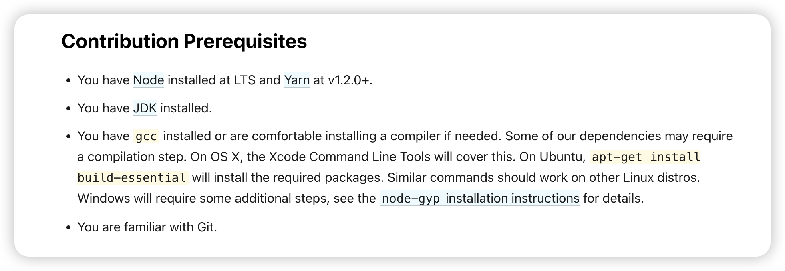

## Fork Official Repository

> [facebook/react](https://github.com/facebook/react)


> Usually, open-source projects have a [CONTRIBUTING.md](https://github.com/facebook/react/blob/main/CONTRIBUTING.md) file, which tells other developers how to contribute to the project, or you can find some information about running tests and publishing actions in the [.github/workflows](https://github.com/facebook/react/tree/main/.github/workflows) of the project.


Download and clone the repository

```bash
git clone git@github.com:Debbl/react.git
```

## VSCode Environment

Use VSCode to open

```bash
code react
```

### Plugins

> Because react is written in [flow](https://flow.org/) language (similar to ts), you need to provide support for the relevant languages in VSCode. Download the flow language plugin [flow-for-vscode](https://marketplace.visualstudio.com/items?itemName=flowtype.flow-for-vscode) in VSCode.

```json title=".vscode/extensions.json"
{
  "recommendations": ["flowtype.flow-for-vscode"]
}
```

### Settings

Create the following file in the root directory of the locally opened repository

```json title=".vscode/settings.json"
{
  "javascript.validate.enable": false,
  "typescript.validate.enable": false,
  "flow.enabled": true,
  "flow.useNPMPackagedFlow": true
}
```

> Explain the configuration here, the first two disable the default js ts checks, then enable the flow plugin, and use the flow running under `node_modules`, these are actually enabled by default, see [flow-for-vscode#configuration](https://github.com/flow/flow-for-vscode#configuration) for more details.

## Local Environment

> You can directly refer to the official documentation [contribution-prerequisites](https://legacy.reactjs.org/docs/how-to-contribute.html#contribution-prerequisites), but there are a few things to note



- The corresponding node version in `.nvmrc`, install the corresponding version
- The `packageManager` in `package.json` has the corresponding yarn version
- The java environment does not specify what version, I installed `java 17.0.11 2024-04-16 LTS` here


- gcc environment


## Install Dependencies, Environment Check

> You can refer to this part of the documentation [sending-a-pull-request](https://legacy.reactjs.org/docs/how-to-contribute.html#sending-a-pull-request)

> Use `yarn.lock` to install, here I recommend a good tool [antfu-collective/ni](https://github.com/antfu-collective/ni), directly use `nci` to install, I also reference other people's projects and write a rust version [Debbl/nci](https://github.com/Debbl/nci)

```bash
yarn install --frozen-lockfile
```

> Because I use the M1 chip, I encountered several problems during the installation process

- `/bin/sh: autoreconf: command not found` Use brew to install `brew install autoconf`
- If the previous step is installed using brew, you will encounter a problem [error-cant-exec-aclocal-with-homebrew-installed-autoreconf-on-mac](https://stackoverflow.com/questions/76852766/error-cant-exec-aclocal-with-homebrew-installed-autoreconf-on-mac) Need to install `brew install automake`
- `optipng-bin` dependency error, you can see this [optipng-bin/issues/117](https://github.com/imagemin/optipng-bin/issues/117#issuecomment-1362473572)

### Configure flow environment

```bash
yarn flow
```

> Running this command directly will require you to select the corresponding environment


Use `dom-node` environment

```bash
yarn flow dom-node
```

> After completion, you will find that there is a `.flowconfig` file in the root directory


### Check if flow is effective


> After completion, VSCode will have a prompt

## Test, Local Run

```bash
yarn test
```


## Local Run Packaged React

> You can refer to the [development-workflow](https://legacy.reactjs.org/docs/how-to-contribute.html#development-workflow) part of the documentation


```bash
cd build/oss-experimental/react
yarn link

cd build/oss-experimental/react-dom
yarn link
```

> Note that in the node environment, you need to link three repositories `react` `react-dom` `scheduler`

> You can also directly use the environment in the `fixtures` directory, here I use `fixtures/packaging/webpack/dev`

```bash
cd fixtures/packaging/webpack/dev

yarn

yarn build
```

> You need to replace the `input.js` file, the new version of ReactDom does not have the render function

```js title="fixtures/packaging/webpack/dev/input.js"
var React = require('react')
var ReactDOM = require('react-dom')

ReactDOM.render(
  React.createElement('h1', null, 'Hello World!'),
  document.getElementById('container'),
)
```

```js
var React = require('react')
var { createRoot } = require('react-dom/client')

console.log('react version:', React.version)

const root = createRoot(document.getElementById('container'))
root.render(React.createElement('h1', null, 'Hello World!'))
```

> Use [LiveServer](https://marketplace.visualstudio.com/items?itemName=ritwickdey.LiveServer) to open `fixtures/packaging/webpack/dev/index.html`


