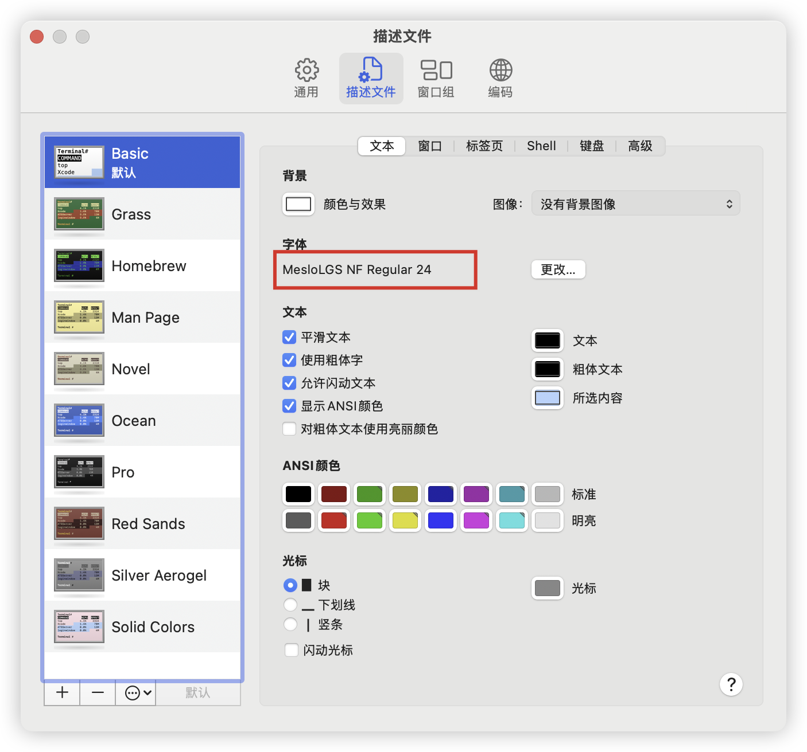
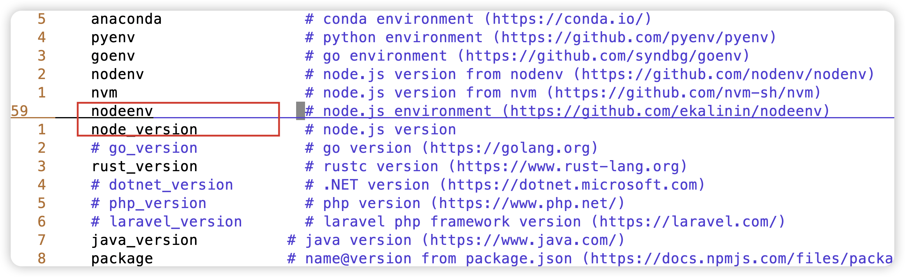
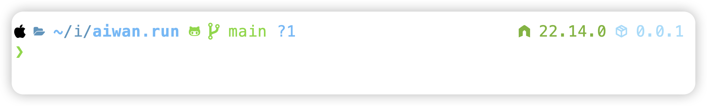
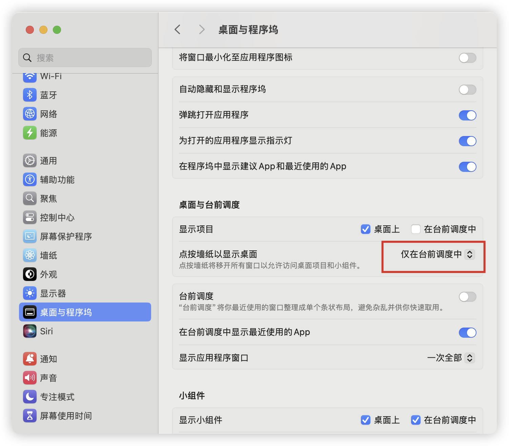
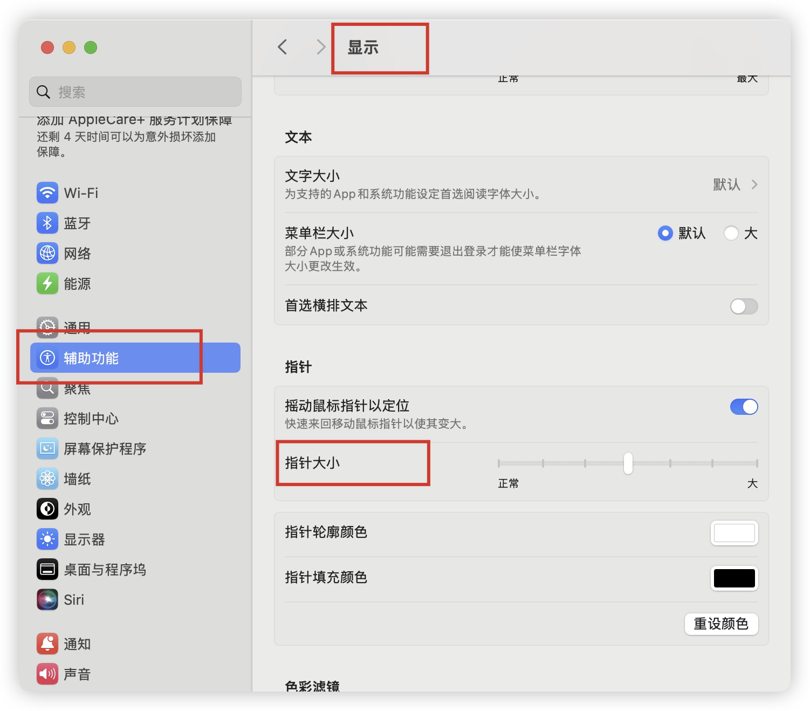
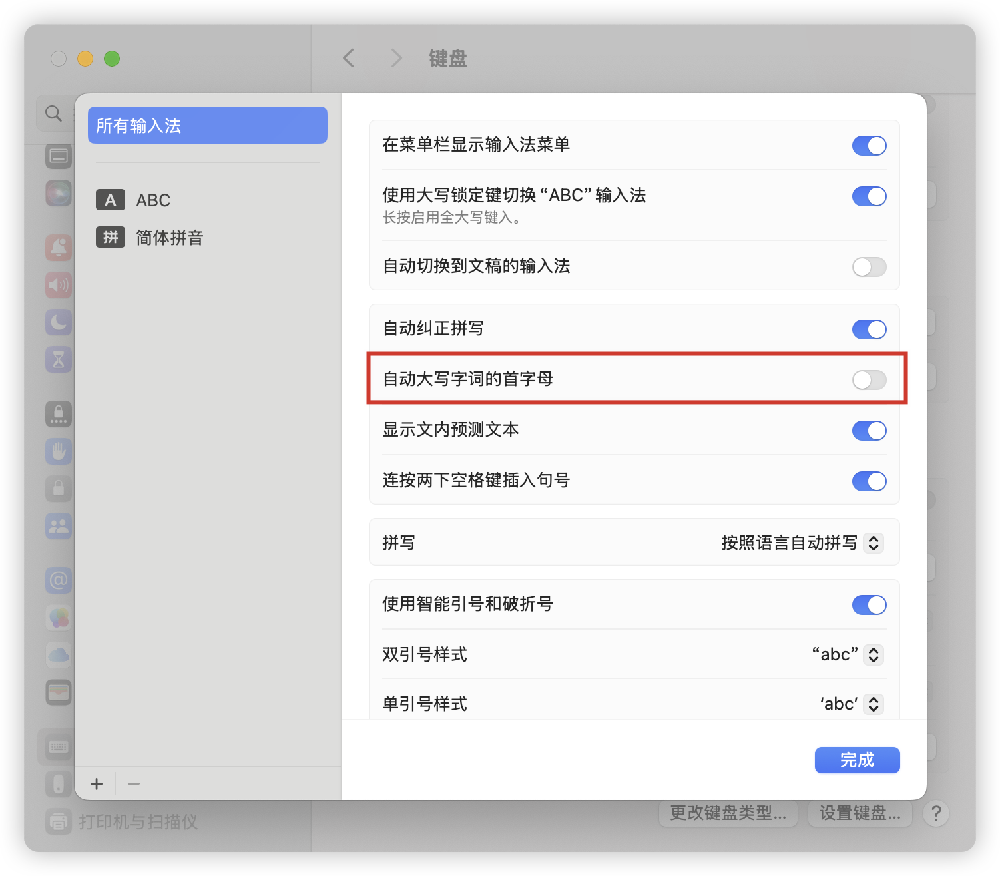
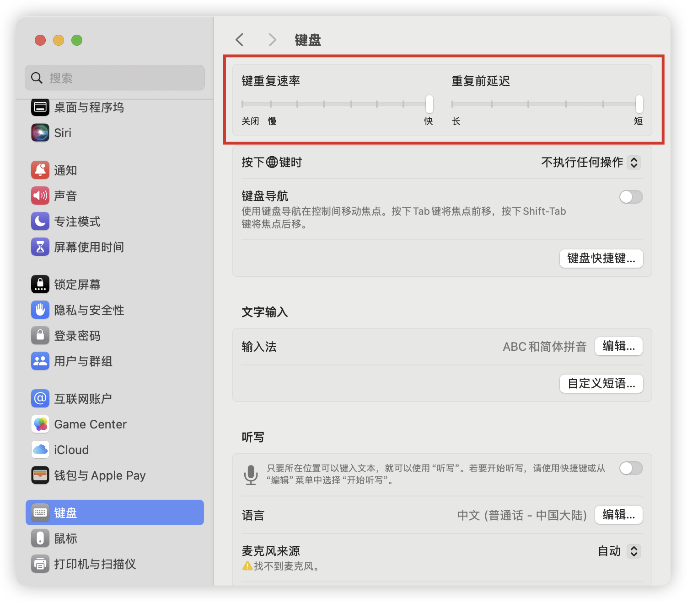

## Install HomeBrew

> Ensure a good network environment

- https://brew.sh/

```sh
/bin/bash -c "$(curl -fsSL https://raw.githubusercontent.com/Homebrew/install/HEAD/install.sh)"
```

> After installation, you will need to execute several commands to set environment variables, as prompted

## Install Oh My Zsh

- https://github.com/ohmyzsh/ohmyzsh#manual-installation

Clone the repository

```sh
git clone https://github.com/ohmyzsh/ohmyzsh.git ~/.oh-my-zsh
```

Copy the template file

```sh
cp ~/.oh-my-zsh/templates/zshrc.zsh-template ~/.zshrc
```

Reload the configuration

```sh
source ~/.zshrc
```

## Install Powerlevel10k

- https://github.com/romkatv/powerlevel10k#oh-my-zsh

Clone the repository

```sh
git clone --depth=1 https://github.com/romkatv/powerlevel10k.git "${ZSH_CUSTOM:-$HOME/.oh-my-zsh/custom}/themes/powerlevel10k"
```

Add to `.zshrc`

```sh
ZSH_THEME="powerlevel10k/powerlevel10k"
```

Reload the configuration

```sh
source ~/.zshrc
```

Install the font file that supports icons

- https://github.com/romkatv/powerlevel10k#manual-font-installation

Terminal settings use font



Custom configuration

```sh
p10k configure
```

Configure the data to be displayed

- https://github.com/romkatv/powerlevel10k#extremely-customizable

Configure the node version and package.json version to be displayed

```sh
vim ~/.p10k.zsh
```





Install zsh plugins

zsh-autosuggestions

- https://github.com/zsh-users/zsh-autosuggestions/blob/master/INSTALL.md#oh-my-zsh

```sh
git clone https://github.com/zsh-users/zsh-autosuggestions ${ZSH_CUSTOM:-~/.oh-my-zsh/custom}/plugins/zsh-autosuggestions
```

zsh-syntax-highlighting

- https://github.com/zsh-users/zsh-syntax-highlighting/blob/master/INSTALL.md#oh-my-zsh

```sh
git clone https://github.com/zsh-users/zsh-syntax-highlighting.git ${ZSH_CUSTOM:-~/.oh-my-zsh/custom}/plugins/zsh-syntax-highlighting
```

Add to `.zshrc`

```sh title=".zshrc"
plugins=(
  git
  sudo
  z
  zsh-autosuggestions
  zsh-syntax-highlighting
)
```

Complete file [.zshrc](https://github.com/Debbl/dotfiles/blob/main/_.zshrc), the file name is `.zshrc`

## Git settings

Generate ssh keys

```sh
ssh-keygen -m PEM -t ed25519 -C "your.email@example.com"
```

View ssh public key

```sh
cat ~/.ssh/id_ed25519.pub
```

Global user name email

```sh
git config --global user.name "Your Name"
git config --global user.email "email@example.com"
```

Current repository user name email

```sh
git config --local user.name "Your Name"
git config --local user.email "email@example.com"
```

Configure `quotepath` option

> Avoid Chinese path乱码

```sh
git config --global core.quotepath false
```

> Do not ignore case

```sh
git config --global core.ignorecase false
```

Complete configuration [.gitconfig](https://github.com/Debbl/dotfiles/blob/main/_.gitconfig)

```plain title=".gitconfig"
[user]
  name = "Your Name"
  email = "email@example.com"

[core]
  quotepath = false
  ignorecase = false
```

## SSH configuration for Git multi-user

Generate multiple ssh keys

```sh
ssh-keygen -m PEM -t ed25519 -C "your.email@example.com" -f ~/.ssh/id_ed25519
```

```sh
ssh-keygen -m PEM -t ed25519 -C "your.email@example.com" -f ~/.ssh/id_ed25519_gitlab
```

Configure ssh configuration file

```sh
vim ~/.ssh/config
```

Complete configuration [.ssh/config](https://github.com/Debbl/dotfiles/blob/main/_.config)

```ssh-config title=".ssh/config"
# Personal account, - the default config
Host github.com
  HostName github.com
  User git
  IdentityFile ~/.ssh/id_ed25519
  ProxyCommand nc -v -x 127.0.0.1:7890 %h %p

# Work account-1
Host gitlab.com
  HostName gitlab.com
  User git
  IdentityFile ~/.ssh/id_ed25519_gitlab
```

> `IdentityFile` is the ssh key configured for the current Host

> `ProxyCommand` is the proxy configured for the GitHub repository, using the `nc` command, `127.0.0.1:7890` is the local proxy port

## Mac settings

> Only when the desktop wallpaper is displayed when the front is scheduled



Adjust the size of the mouse pointer



Disable automatic capitalization



## VSCode settings

- https://github.com/Debbl/vscode-settings

vim settings keyboard repeat



Global open keyboard long press continuous input

```sh
defaults write -g ApplePressAndHoldEnabled -bool false
```
