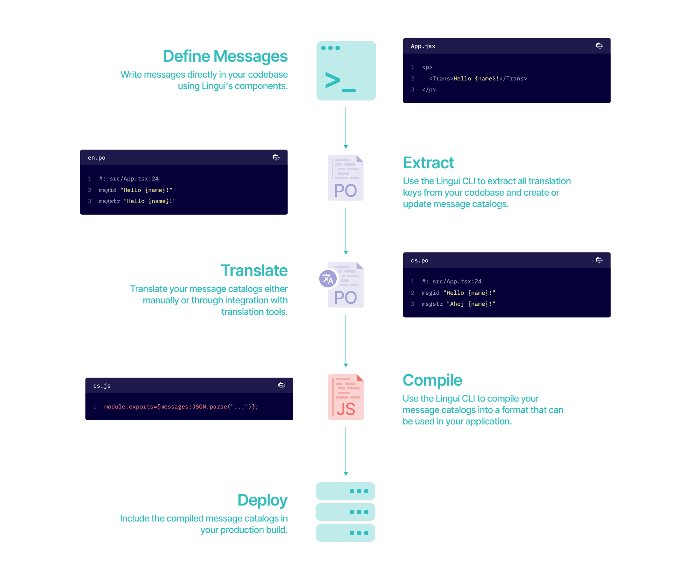
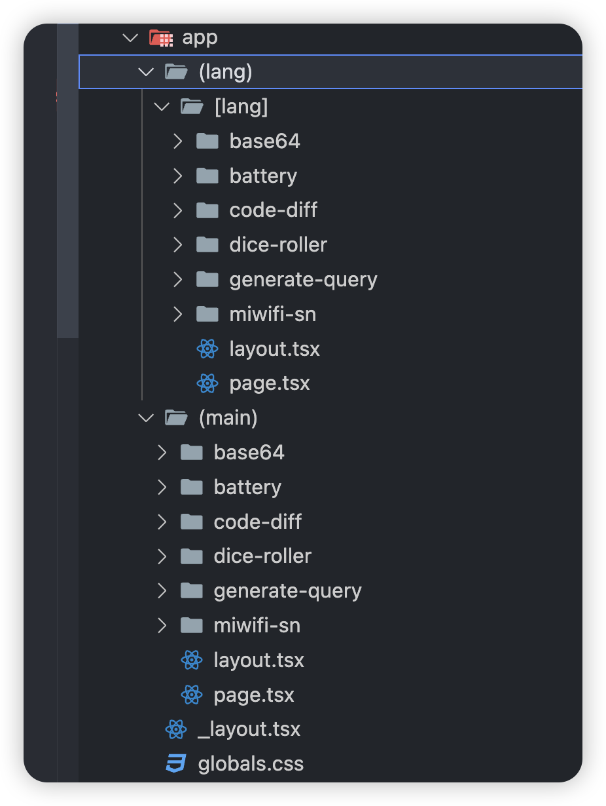
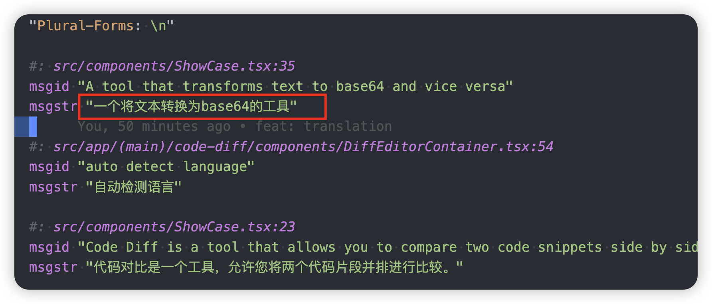

Related articles

- https://dodov.dev/blog/how-to-set-up-simple-nextjs-localization
- https://lingui.dev/tutorials/react-rsc

Implementation

- https://github.com/Debbl/tools.aiwan.run/pull/28
- https://github.com/lingui/js-lingui/tree/main/examples/nextjs-swc



## Install dependencies

```sh
pnpm add @lingui/core @lingui/react
pnpm add @lingui/cli @lingui/loader @lingui/swc-plugin -D
```

## Configure nextjs swc plugin to parse `.po` file

```diff
const nextConfig: NextConfig = {
  output: "export",
+  webpack: (config) => {
+    config.module.rules.push({
+      test: /\.po$/,
+      use: {
+        loader: "@lingui/loader",
+      },
+    });
+    return config;
+  },
+  experimental: {
+    swcPlugins: [["@lingui/swc-plugin", {}]],
+  },
  transpilePackages: ["three"],
};
```

## Lingui configuration

```ts title="lingui.config.ts"
import { defineConfig } from '@lingui/cli'

export default defineConfig({
  sourceLocale: 'en',
  locales: ['zh', 'en'],
  catalogs: [
    {
      path: '<rootDir>/src/locales/{locale}/messages',
      include: ['src'],
    },
  ],
})
```

## Localization

Parse the `message.po` file, provide a global context

```ts title="i18n.ts"
import { setupI18n } from '@lingui/core'
import linguiConfig from '../lingui.config'
import 'server-only'
import type { I18n, Messages } from '@lingui/core'

export const { locales, sourceLocale } = linguiConfig
type SupportedLocales = string

async function loadCatalog(locale: SupportedLocales): Promise<{
  [k: string]: Messages
}> {
  const { messages } = await import(`./locales/${locale}/messages.po`)
  return {
    [locale]: messages,
  }
}
const catalogs = await Promise.all(locales.map(loadCatalog))

export const allMessages = catalogs.reduce((acc, oneCatalog) => {
  return { ...acc, ...oneCatalog }
}, {})

type AllI18nInstances = { [K in SupportedLocales]: I18n }

export const allI18nInstances: AllI18nInstances = locales.reduce(
  (acc, locale) => {
    const messages = allMessages[locale] ?? {}
    const i18n = setupI18n({
      locale,
      messages: { [locale]: messages },
    })
    return { ...acc, [locale]: i18n }
  },
  {},
)

export const getI18nInstance = (locale: SupportedLocales): I18n => {
  if (!allI18nInstances[locale]) {
    console.warn(`No i18n instance found for locale "${locale}"`)
  }
  return allI18nInstances[locale]! || allI18nInstances.en!
}
```

provider

```ts title="LinguiClientProvider.tsx"
"use client";
import { setupI18n } from "@lingui/core";
import { I18nProvider } from "@lingui/react";
import { useState } from "react";
import type { Messages } from "@lingui/core";

export function LinguiClientProvider({
  children,
  initialLocale,
  initialMessages,
}: {
  children: React.ReactNode;
  initialLocale: string;
  initialMessages: Messages;
}) {
  const [i18n] = useState(() => {
    return setupI18n({
      locale: initialLocale,
      messages: { [initialLocale]: initialMessages },
    });
  });

  return <I18nProvider i18n={i18n}>{children}</I18nProvider>;
}
```

Global configuration

```diff
import { setI18n } from "@lingui/react/server";
import { Inter } from "next/font/google";
import { Toaster } from "react-hot-toast";
+import { getI18nInstance } from "~/i18n";
+import { LinguiClientProvider } from "~/providers/LinguiClientProvider";
import { Providers } from "../providers";
import "./globals.css";
import type { Metadata } from "next";
import type { ReactNode } from "react";

const inter = Inter({ subsets: ["latin"] });

export const metadata: Metadata = {
  title: "Magic tools",
  description: "a magic tools for developers",
  icons: ["/favicon.ico"],
};

export function getRootLayout(lang: string) {
  function RootLayout({ children }: { children: ReactNode }) {
+    const i18n = getI18nInstance(lang);
+    setI18n(i18n);

    return (
      <html lang={lang}>
        <body className={inter.className}>
          <Toaster />
+         <LinguiClientProvider
+            initialLocale={lang}
+            initialMessages={i18n.messages}
+          >
            <Providers>{children}</Providers>
+          </LinguiClientProvider>
        </body>
      </html>
    );
  }
  return RootLayout;
}
```

## Routing

The effect to be achieved is that there are two `en` and `zh`, and the `en` path can be hidden, the specific idea is to implement two [RootLayout](https://nextjs.org/docs/app/building-your-application/routing/route-groups#creating-multiple-root-layouts)



Then in the lang path, import the corresponding component

```ts title="layout.tsx"
export { default, metadata } from '../../../(main)/base64/layout'
```

```ts title="page.tsx"
export { default } from '../../../(main)/base64/page'
```

The default setting of the main route is `en`, the lang route obtains the corresponding lang according to `generateStaticParams`, and here a `getRootLayout` function is extracted to obtain the specific `RootLayout`

```tsx title="_layout.tsx"
export function getRootLayout(lang: string) {
  function RootLayout({ children }: { children: ReactNode }) {
    const i18n = getI18nInstance(lang)
    setI18n(i18n)

    return (
      <html lang={lang}>
        <body className={inter.className}>
          <Toaster />
          <LinguiClientProvider
            initialLocale={lang}
            initialMessages={i18n.messages}
          >
            <Providers>{children}</Providers>
          </LinguiClientProvider>
        </body>
      </html>
    )
  }
  return RootLayout
}
```

```tsx title="src/app/(main)/layout.tsx"
import { getRootLayout } from '../_layout'

export { metadata } from '../_layout'

const RootLayout = getRootLayout('en')
export default RootLayout
```

```tsx title="src/app/(lang)/[lang]/layout.tsx"
import { locales } from '~/i18n'
import { getRootLayout } from '../../_layout'

export { metadata } from '../../_layout'

interface Props {
  params: Promise<{
    lang: string
  }>
  children: React.ReactNode
}

export async function generateStaticParams() {
  return locales.map((locale) => ({ lang: locale }))
}

export default async function Layout({ params, children }: Props) {
  const { lang } = await params
  const RootLayout = getRootLayout(lang)

  return <RootLayout>{children}</RootLayout>
}
```

## Link

After adding `en` `zh`, some route links may not jump to the current language, `useI18nHelper` is implemented as a helper

```ts
import { useLingui } from '@lingui/react/macro'
import { usePathname, useRouter } from 'next/navigation'

export function useI18nHelper() {
  const router = useRouter()
  const pathname = usePathname()
  const { i18n } = useLingui()

  const sourceLocale = 'en'
  const locales = ['en', 'zh']

  const switchLocale = () => {
    const newLocale =
      locales.find((locale) => locale !== i18n.locale) || sourceLocale

    const realPathname = pathname.split('/').filter((i, index) => {
      if (index === 1 && i === i18n.locale) return false
      return Boolean(i)
    })

    const newPathname =
      newLocale === sourceLocale
        ? `/${realPathname.join('/')}`
        : `/${newLocale}/${realPathname.join('/')}`

    router.push(newPathname)
  }

  const getRealPathname = (path: string) => {
    const isLocalePath = locales.includes(pathname.split('/')[1])

    return isLocalePath
      ? [i18n.locale, ...path.split('/').filter(Boolean)].join('/')
      : path
  }

  return {
    // FIXME import from config file
    sourceLocale,
    locales,
    switchLocale,
    getRealPathname,
  }
}
```

## Build

Add extraction command

```json
{
  "scripts": {
    "extract": "lingui extract",
    "compile": "lingui compile"
  }
}
```

Manual translation or translation with tools


