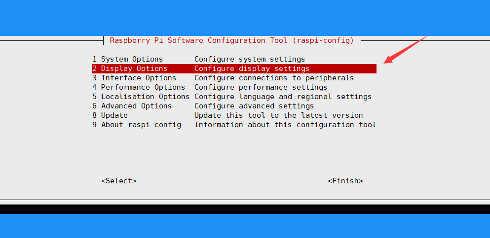
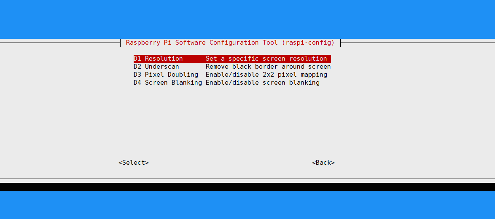
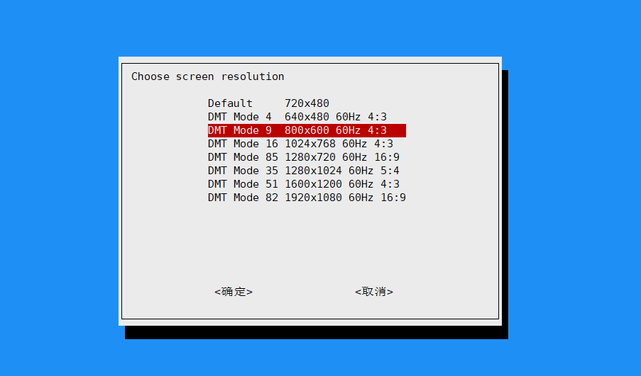

### SSH 连接

- 有屏幕

  - 直接用鼠标点击操作

- 无屏幕有线网络

  - 在 SD 卡的根目录（ boot ）中新建 `SSH` 文件（文件无内容）

  - 获取树莓派的 IP 地址

  - 用 SSH 连接工具连接树莓派

- 无屏幕无线网络

  - 开启 SSH， 即第二步的在 SD 卡的根目录新建 `SSH` 文件

  - 在 SD 卡的根目录（ boot ），新建 `wpa_supplicant.conf` 文件（这个文件是用来添加无线连接的）

    ```text title="config"
    ctrl_interface=DIR=/var/run/wpa_supplicant GROUP=netdev
    update_config=1
    country=GB
    # 修改下面的配置
    network={
      ssid="Wi-Fi名"
      psk="Wi-Fi密码"
      key_mgmt=WPA-PSK
    }
    ```

  - 使用 SSH 连接工具

### 扩展功能

- SSH
- VNC
- 摄像头
- 等

在终端中输入

```bash
sudo raspi-config
```

### 连接 VNC

- 鼠标操作

- 直接在终端输入，这个是临时的而且一次只能开一个

  ```bash
  vncserver
  ```

  ```
  # 1 是端口，geometry 是分辨率
  vncserver :1 -geometry 800x480
  ```

  > 树莓派 4B 默认没有分辨率设置，所以第一次使用 VNC 可能无法显示，需要配置一下

  

  

  

- 使用命令 `sudo respi-config` 打开 VNC

### 补充

#### 查看基本配置和引脚

```bash
pinout
```
