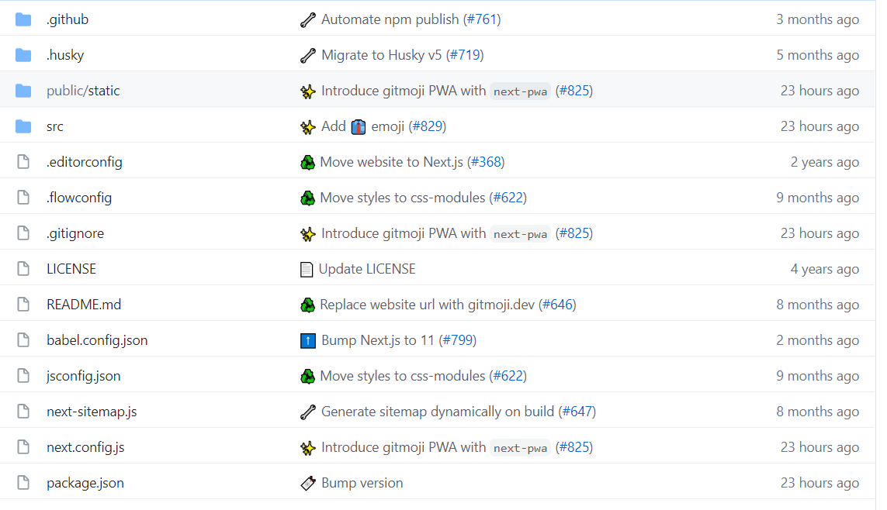

### 🎉 Why use Gitmoji

When we execute `git commit`, we use emoji to label the commit, making the main work of this commit stand out, and also making it easier to distinguish and find in the entire commit history.



### 👌 Commit format

```sh
git commit -m ":emoji1: :emoji2: summary of no more than 50 words, the first letter is capitalized, use the imperative tone, and do not add a period at the end"
```

#### Initial commit example

```sh
git commit -m ":tada: Initialize Repo"
```

### 📝emoji guide

|              emoji              |          emoji code           |                      commit description                      |
| :-----------------------------: | :---------------------------: | :----------------------------------------------------------: |
|           🎉（tada）            |           `:tada:`            |            Initial commit, initialize repository             |
|            🎨（art）            |            `:art:`            |              Improve code structure/code format              |
|            ⚡（zap）            |            `:zap:`            |                     Improve performance                      |
|           🔥（fire）            |           `:fire:`            |                     Delete code or file                      |
|            🐛（bug）            |            `:bug:`            |                          Fix a bug                           |
|         🚑（ambulance）         |         `:ambulance:`         |                       Important patch                        |
|         ✨（sparkles）          |         `:sparkles:`          |                    Introduce new features                    |
|           📝（memo）            |           `:memo:`            |                    Add or update document                    |
|          🚀（rocket）           |          `:rocket:`           |                        Deploy feature                        |
|         💄（lipstick）          |         `:lipstick:`          |               Add or update UI and style file                |
|     ✅（white_check_mark）      |     `:white_check_mark:`      |                   Add, update or pass test                   |
|           🔒（lock）            |           `:lock:`            |                      Fix security issue                      |
|         🔖（bookmark）          |         `:bookmark:`          |                     Release/version tag                      |
|      🚨（rotating_light）       |      `:rotating_light:`       |                 Fix compiler/linter warning                  |
|       🚧（construction）        |       `:construction:`        |                       Work in progress                       |
|        💚（green_heart）        |        `:green_heart:`        |                         Fix CI build                         |
|        ⬇️（arrow_down）         |        `:arrow_down:`         |                    Downgrade dependencies                    |
|         ⬆️（arrow_up）          |         `:arrow_up:`          |                     Upgrade dependencies                     |
|          📌（pushpin）          |          `:pushpin:`          |            Pin dependencies to a specific version            |
|    👷（construction_worker）    |    `:construction_worker:`    |                Add or update CI build system                 |
| 📈（chart_with_upwards_trend）  | `:chart_with_upwards_trend:`  |                  Add analysis or track code                  |
|          ♻️（recycle）          |          `:recycle:`          |                        Refactor code                         |
|      ➕（heavy_plus_sign）      |      `:heavy_plus_sign:`      |                       Add dependencies                       |
|     ➖（heavy_minus_sign）      |     `:heavy_minus_sign:`      |                     Delete dependencies                      |
|          🔧（wrench）           |          `:wrench:`           |               Add or update configuration file               |
|          🔨（hammer）           |          `:hammer:`           |               Add or update development script               |
|   🌐（globe_with_meridians）    |   `:globe_with_meridians:`    |            Internationalization and localization             |
|          ✏️（pencil2）          |          `:pencil2:`          |                          Fix typos                           |
|           💩（poop）            |           `:poop:`            |           Write bad code that needs to be improved           |
|          ⏪（rewind）           |          `:rewind:`           |                        Revert changes                        |
| 🔀（twisted_rightwards_arrows） | `:twisted_rightwards_arrows:` |                        Merge branches                        |
|          📦（package）          |          `:package:`          |            Add or update compiled file or package            |
|           👽（alien）           |           `:alien:`           |           Update code due to external API changes            |
|           🚚（truck）           |           `:truck:`           |    Move or rename resources (e.g., files, paths, routes)     |
|      📄（page_facing_up）       |      `:page_facing_up:`       |                    Add or update license                     |
|           💥（boom）            |           `:boom:`            |                   Introduce major changes                    |
|           🍱（bento）           |           `:bento:`           |                     Add or update assets                     |
|        ♿（wheelchair）         |        `:wheelchair:`         |                    Improve accessibility                     |
|           💡（bulb）            |           `:bulb:`            |             Add or update comment in source code             |
|           🍻（beers）           |           `:beers:`           |              Write code that was not considered              |
|      💬（speech_balloon）       |      `:speech_balloon:`       |                 Add or update text and text                  |
|       🗃️（card_file_box）       |       `:card_file_box:`       |           Execute changes related to the database            |
|        🔊（loud_sound）         |        `:loud_sound:`         |                      Add or update log                       |
|           🔇（mute）            |           `:mute:`            |                          Delete log                          |
|    👥（busts_in_silhouette）    |    `:busts_in_silhouette:`    |               Add or update contributors/them                |
|     🚸（children_crossing）     |     `:children_crossing:`     |              Improve user experience/usability               |
|   🏗️（building_construction）   |   `:building_construction:`   |                 Perform architecture changes                 |
|          📱（iphone）           |          `:iphone:`           |                        Mobile design                         |
|        🤡（clown_face）         |        `:clown_face:`         |                       Simulate things                        |
|            🥚（egg）            |            `:egg:`            |                   Add or update Easter egg                   |
|        🙈（see_no_evil）        |        `:see_no_evil:`        |                Add or update .gitignore file                 |
|       📸（camera_flash）        |       `:camera_flash:`        |                    Add or update snapshot                    |
|          ⚗️（alembic）          |          `:alembic:`          |                      Perform experiment                      |
|            🔍（mag）            |            `:mag:`            |           Improve search engine optimization (SEO)           |
|           🏷️（label）           |           `:label:`           |                      Add or update type                      |
|         🌱（seedling）          |         `:seedling:`          |              Add or update seed (template) file              |
|  🚩（triangular_flag_on_post）  |  `:triangular_flag_on_post:`  |              Add, update or delete feature flag              |
|         🥅（goal_net）          |         `:goal_net:`          |                         Catch error                          |
|           💫（dizzy）           |           `:dizzy:`           |            Add or update animation and transition            |
|        🗑️（wastebasket）        |        `:wastebasket:`        |           Deprecated code that needs to be cleaned           |
|     🛂（passport_control）      |     `:passport_control:`      | Handle code related to authorization, roles, and permissions |
|     🩹（adhesive_bandage）      |     `:adhesive_bandage:`      |             - Fix simple non-critical problems -             |
|       🧐（monocle_face）        |       `:monocle_face:`        |                  - Data exploration/check -                  |
|          ⚰️（coffin）           |          `:coffin:`           |                     Delete invalid code                      |
|         🧪（test_tube）         |         `:test_tube`          |                     - Add failed test -                      |
|          👔（necktie）          |          `:necktie:`          |                 Add or update business logic                 |

### 🔍 Reference

https://github.com/carloscuesta/gitmoji

https://github.com/liuchengxu/git-commit-emoji-cn

### 🌐 Emoji website

https://gitmoji.dev/

http://emojihomepage.com/

https://emojipedia.org/
