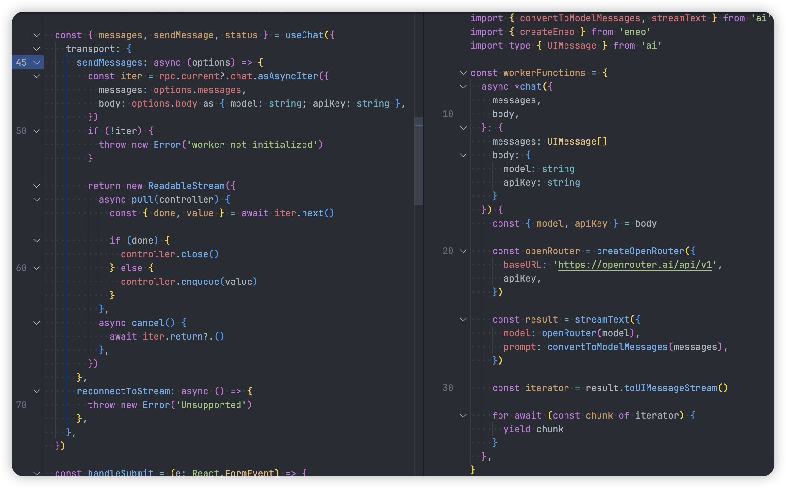
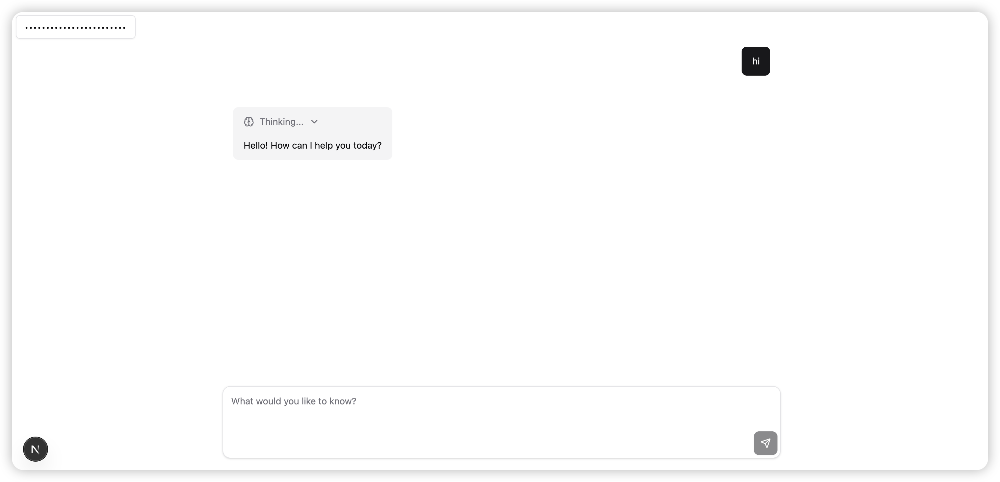

## Introduction

AI SDK 5 has an important update where you can directly use [transport](https://ai-sdk.dev/docs/reference/ai-sdk-ui/use-chat#transport) to implement specific message sending methods, such as defining how messages are passed to the worker.

Here we use [birpc](https://github.com/antfu/birpc) to implement message passing. It's a lightweight RPC library that supports communication between any two endpoints.

However, it seems it doesn't support async iterator for message passing, but there's an unmerged PR that supports this feature [birpc#20](https://github.com/antfu/birpc/pull/20). So based on this PR, a new library [eneo](https://github.com/Debbl/eneo) was created.

## Using Eneo for Message Passing

This example uses [openrouter](https://openrouter.ai/) to demonstrate message passing with Eneo. First, you need to create an Eneo instance, then define the message functions that need to be passed, and finally use createEneo to create an Eneo instance.

```ts title="worker.ts"
import { createOpenRouter } from '@openrouter/ai-sdk-provider'
import { convertToModelMessages, streamText } from 'ai'
import { createEneo } from 'eneo'
import type { UIMessage } from 'ai'

const workerFunctions = {
  async *chat({
    messages,
    body,
  }: {
    messages: UIMessage[]
    body: {
      model: string
      apiKey: string
    }
  }) {
    const { model, apiKey } = body

    const openRouter = createOpenRouter({
      baseURL: 'https://openrouter.ai/api/v1',
      apiKey,
    })

    const result = streamText({
      model: openRouter(model),
      prompt: convertToModelMessages(messages),
    })

    const iterator = result.toUIMessageStream()

    for await (const chunk of iterator) {
      yield chunk
    }
  },
}

export type WorkerFunctions = typeof workerFunctions

createEneo(workerFunctions, {
  post: (data) => self.postMessage(data),
  on: (fn) => self.addEventListener('message', fn),
  off: (fn) => self.removeEventListener('message', fn),
  deserialize: (e) => e.data,
})
```

Using `useChat`, here we define how to pass messages to the worker through a custom transport.

```ts title="page.ts"
import { useRef, useState, useEffect } from 'react'
import { useChat } from '@ai-sdk/react'
import type { EneoReturn } from 'eneo'
import type { WorkerFunctions } from '~/worker'

export default function Page() {
  const rpc = useRef<EneoReturn<WorkerFunctions>>(null)
  const [input, setInput] = useState('')
  const [apiKey, setApiKey] = useAtom(apiKeyAtom)

  const { messages, sendMessage, status } = useChat({
    transport: {
      sendMessages: async (options) => {
        const iter = rpc.current?.chat.asAsyncIter({
          messages: options.messages,
          body: options.body as { model: string; apiKey: string },
        })
        if (!iter) {
          throw new Error('worker not initialized')
        }

        return new ReadableStream({
          async pull(controller) {
            const { done, value } = await iter.next()

            if (done) {
              controller.close()
            } else {
              controller.enqueue(value)
            }
          },
          async cancel() {
            await iter.return?.()
          },
        })
      },
      reconnectToStream: async () => {
        throw new Error('Unsupported')
      },
    },
  })

  useEffect(() => {
    const worker = new Worker(new URL('./worker.ts', import.meta.url))

    rpc.current = createEneo(
      {},
      {
        post: (data) => worker.postMessage(data),
        // eslint-disable-next-line react-web-api/no-leaked-event-listener
        on: (fn) => worker.addEventListener('message', fn),
        off: (fn) => worker.removeEventListener('message', fn),
        deserialize: (e) => e.data,
      },
    )

    const cleanup = () => {
      rpc.current?.$close()
      worker.terminate()
    }

    return () => {
      cleanup()
    }
  }, [])

  return null // your ui
}
```



## AI Playground

For a specific example, you can check out [ai-playground](https://github.com/Debbl/ai-playground/tree/v0.0.0).

