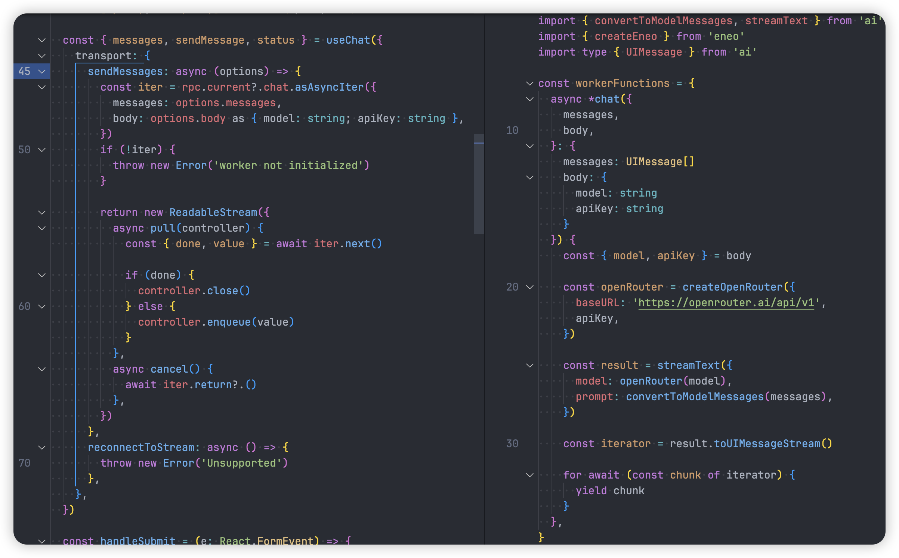
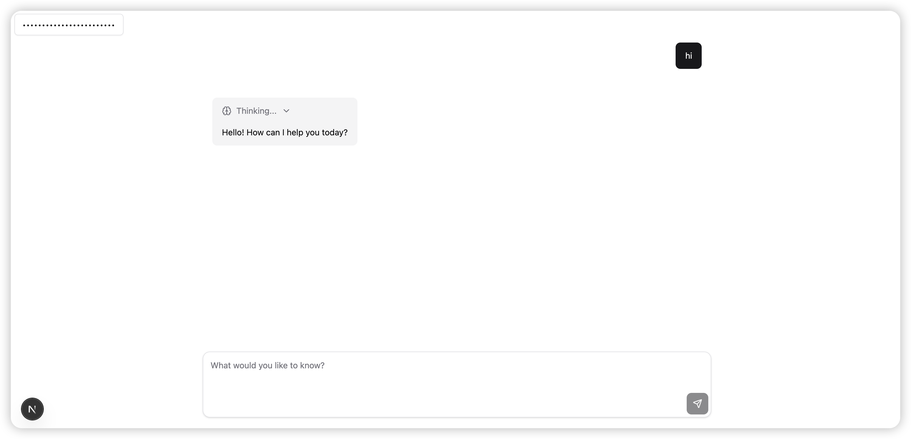

## 前言

AI SDK 5 有一个重要的更新你可以直接使用 [transport](https://ai-sdk.dev/docs/reference/ai-sdk-ui/use-chat#transport) 来实现具体的发送消息的方式，比如可以定义 messages 如何传递给 worker。

这里使用 [birpc](https://github.com/antfu/birpc) 来实现消息的传递，它是一个轻量级的 RPC 库，支持任意两个端点之间的通信。

但是好像不支持生成器的方式传递消息，但是有一个没有合并的 pr 支持了这个功能 [birpc#20](https://github.com/antfu/birpc/pull/20)，所以根据这个 pr 创建了一个新的库 [eneo](https://github.com/Debbl/eneo)。

## 使用 Eneo 实现消息传递

这个以 [openrouter](https://openrouter.ai/) 为例，使用 Eneo 实现消息传递，首先需要创建一个 Eneo 实例，然后定义需要传递的消息函数，最后使用 createEneo 创建一个 Eneo 实例。

```ts title="worker.ts"
import { createOpenRouter } from '@openrouter/ai-sdk-provider'
import { convertToModelMessages, streamText } from 'ai'
import { createEneo } from 'eneo'
import type { UIMessage } from 'ai'

const workerFunctions = {
  async *chat({
    messages,
    body,
  }: {
    messages: UIMessage[]
    body: {
      model: string
      apiKey: string
    }
  }) {
    const { model, apiKey } = body

    const openRouter = createOpenRouter({
      baseURL: 'https://openrouter.ai/api/v1',
      apiKey,
    })

    const result = streamText({
      model: openRouter(model),
      prompt: convertToModelMessages(messages),
    })

    const iterator = result.toUIMessageStream()

    for await (const chunk of iterator) {
      yield chunk
    }
  },
}

export type WorkerFunctions = typeof workerFunctions

createEneo(workerFunctions, {
  post: (data) => self.postMessage(data),
  on: (fn) => self.addEventListener('message', fn),
  off: (fn) => self.removeEventListener('message', fn),
  deserialize: (e) => e.data,
})
```

使用 `useChat`，这里通过自定义 transport 来定义传递给 worker 的方式。

```ts title="page.ts"
import { useRef, useState, useEffect } from 'react'
import { useChat } from '@ai-sdk/react'
import type { EneoReturn } from 'eneo'
import type { WorkerFunctions } from '~/worker'

export default function Page() {
  const rpc = useRef<EneoReturn<WorkerFunctions>>(null)
  const [input, setInput] = useState('')
  const [apiKey, setApiKey] = useAtom(apiKeyAtom)

  const { messages, sendMessage, status } = useChat({
    transport: {
      sendMessages: async (options) => {
        const iter = rpc.current?.chat.asAsyncIter({
          messages: options.messages,
          body: options.body as { model: string; apiKey: string },
        })
        if (!iter) {
          throw new Error('worker not initialized')
        }

        return new ReadableStream({
          async pull(controller) {
            const { done, value } = await iter.next()

            if (done) {
              controller.close()
            } else {
              controller.enqueue(value)
            }
          },
          async cancel() {
            await iter.return?.()
          },
        })
      },
      reconnectToStream: async () => {
        throw new Error('Unsupported')
      },
    },
  })

  useEffect(() => {
    const worker = new Worker(new URL('./worker.ts', import.meta.url))

    rpc.current = createEneo(
      {},
      {
        post: (data) => worker.postMessage(data),
        // eslint-disable-next-line react-web-api/no-leaked-event-listener
        on: (fn) => worker.addEventListener('message', fn),
        off: (fn) => worker.removeEventListener('message', fn),
        deserialize: (e) => e.data,
      },
    )

    const cleanup = () => {
      rpc.current?.$close()
      worker.terminate()
    }

    return () => {
      cleanup()
    }
  }, [])

  return null // your ui
}
```



## AI Playground

具体示例可以查看 [ai-playground](https://github.com/Debbl/ai-playground/tree/v0.0.0)。

