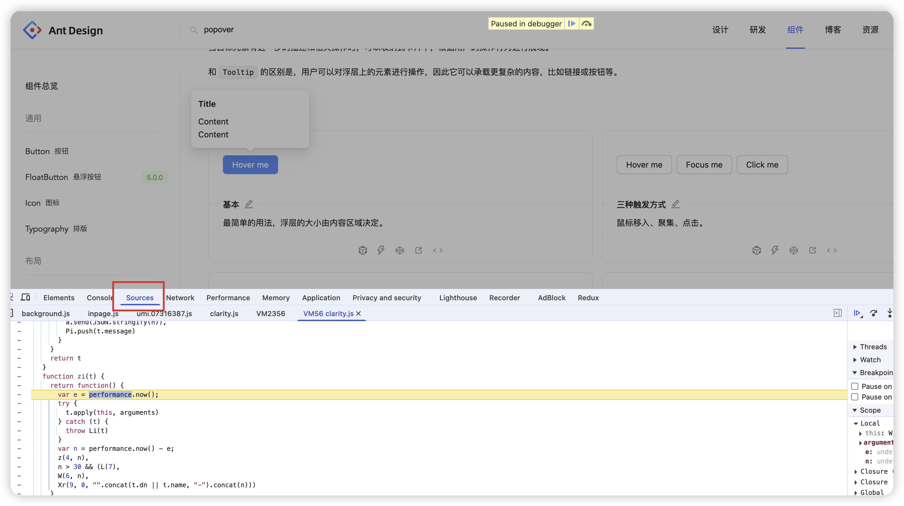
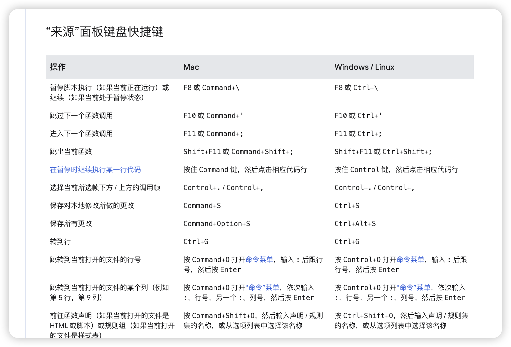

When debugging the style of components like `Popover`, it is difficult to locate the position of the pop-up box. If the pop-up box is expanded through js, you can pause the script execution through `F8` to locate the position of the pop-up box.

**Note: You need to operate in the `Sources` panel**

## Chrome shortcuts

- https://developer.chrome.com/docs/devtools/shortcuts?hl=zh-cn

## Pause script execution

- https://developer.chrome.com/docs/devtools/shortcuts?hl=zh-cn#sources

