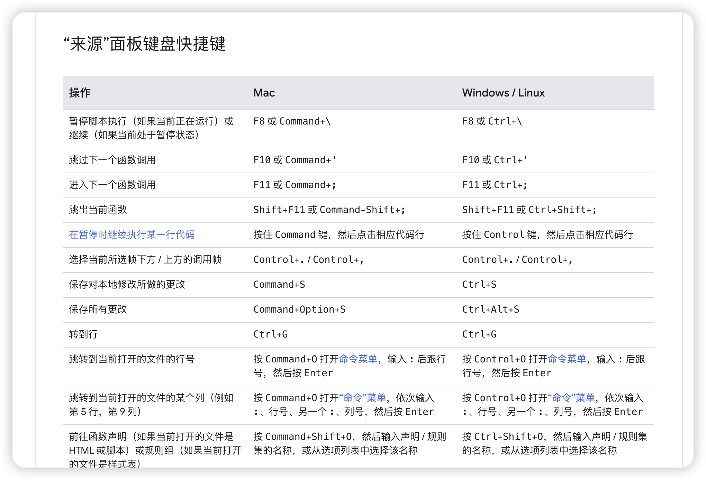

一般在调试类似 `Popover` 组件的样式时，比较难定位到弹出框的位置，如果弹出框是通过 js 展开的，可以通过 `F8` 暂停脚本的执行

**注意要在 `Sources` 面板操作**

## Chrome 快捷键

- https://developer.chrome.com/docs/devtools/shortcuts?hl=zh-cn

## 暂停脚本执行

- https://developer.chrome.com/docs/devtools/shortcuts?hl=zh-cn#sources

