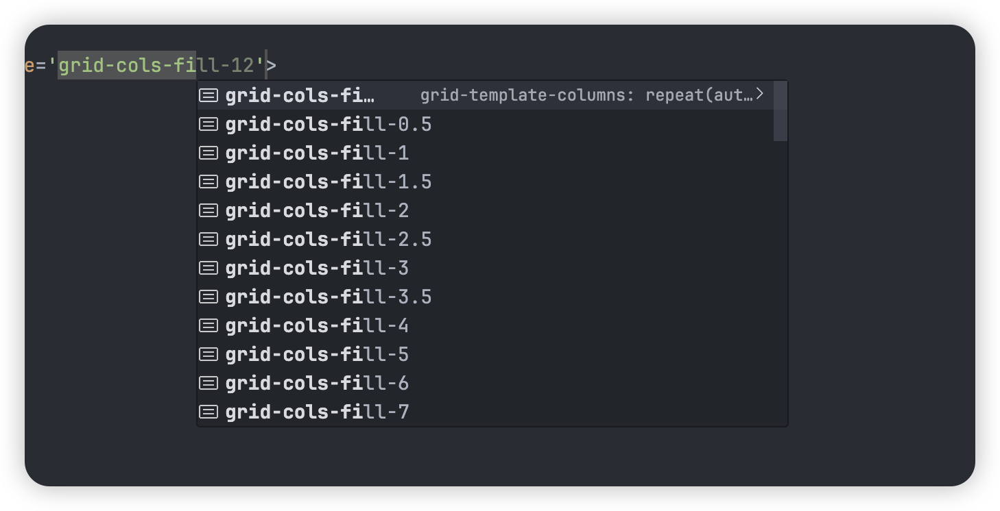

一个自定义工具，将 `grid-cols-fill-12` 设置为 `grid-template-columns: repeat(auto-fill, minmax(3rem, 12))`

```css
@utility grid-cols-fill-* {
  grid-template-columns: repeat(
    auto-fill,
    minmax(--spacing(--value(number)), 1fr)
  );
}

@utility grid-cols-fit-* {
  grid-template-columns: repeat(
    auto-fit,
    minmax(--spacing(--value(number)), 1fr)
  );
}
```


