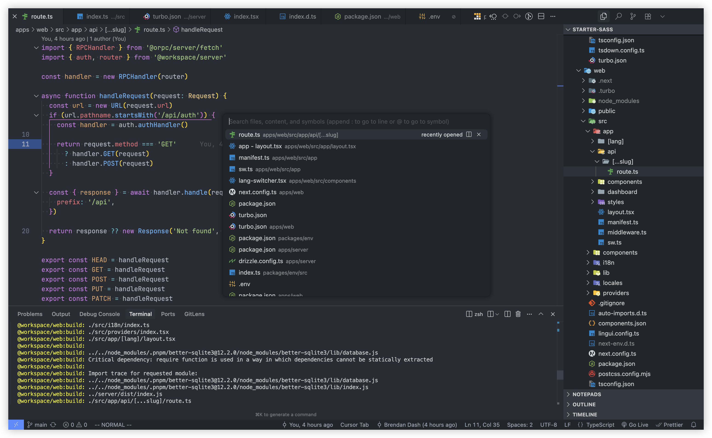

a vscode extension to customize the vscode ui

- [Custom UI Style](https://marketplace.visualstudio.com/items?itemName=subframe7536.custom-ui-style)

like this you can customize the vscode quick input widget position

```json title="settings.json"
{
  "custom-ui-style.stylesheet": {
    ".quick-input-widget": "top: 25vh !important"
  }
}
```


