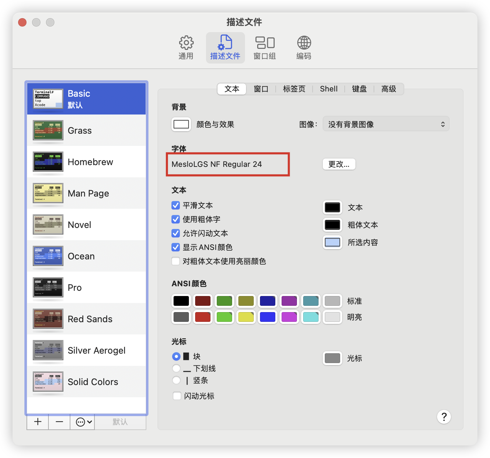
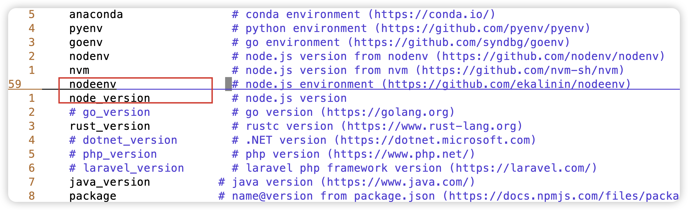
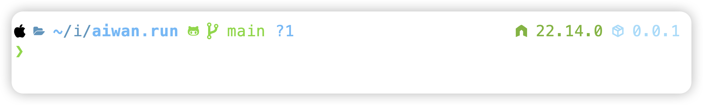
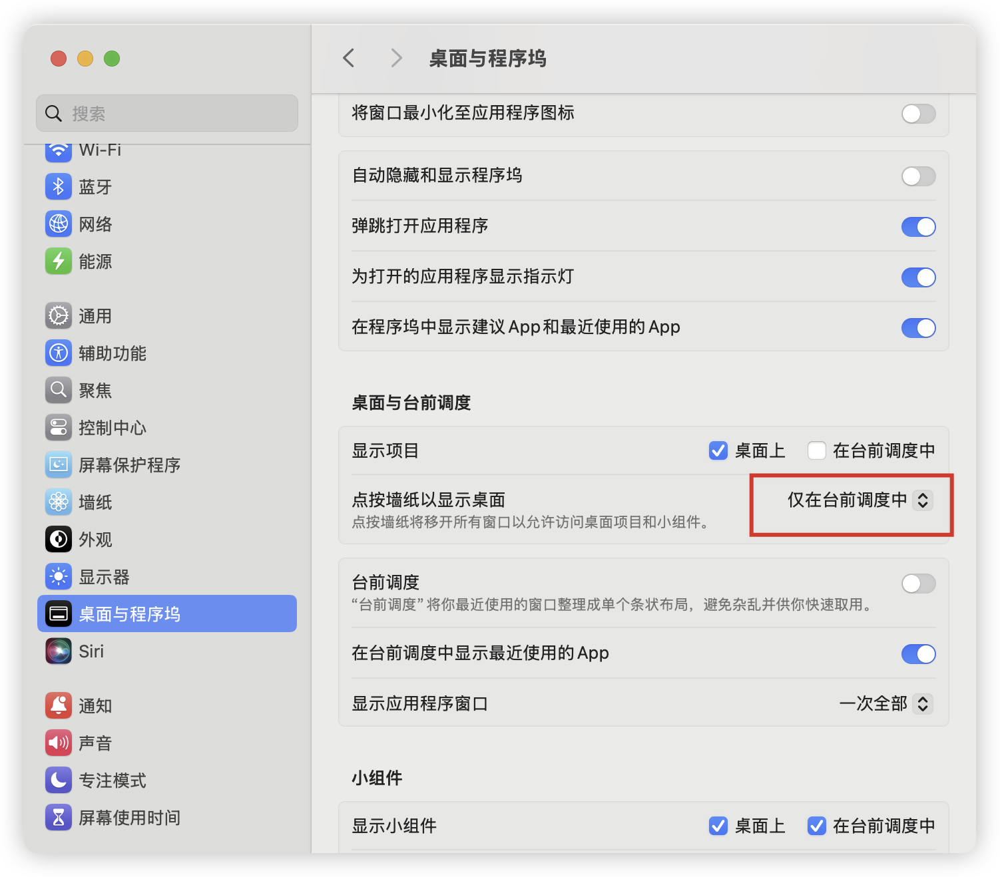
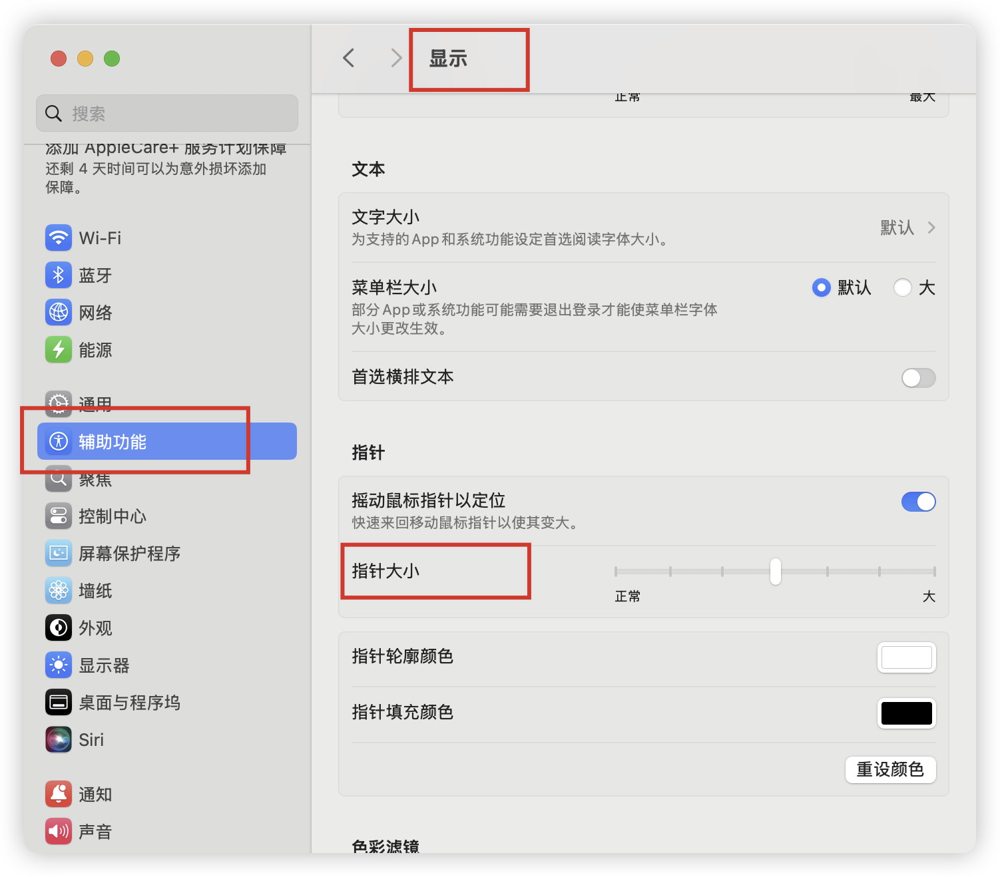
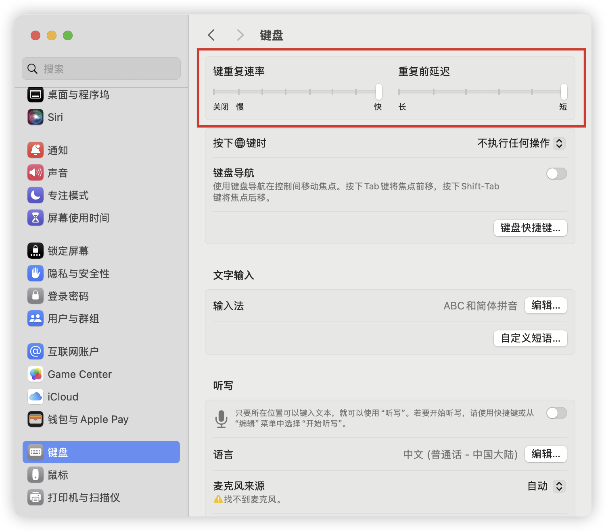

## 安装 HomeBrew

> 确保有良好的网络环境

- https://brew.sh/

```sh
/bin/bash -c "$(curl -fsSL https://raw.githubusercontent.com/Homebrew/install/HEAD/install.sh)"
```

这里安装完成后会需要执行几个命令设置环境变量，由对应的提示

## 安装 Oh My Zsh

- https://github.com/ohmyzsh/ohmyzsh#manual-installation

克隆仓库

```sh
git clone https://github.com/ohmyzsh/ohmyzsh.git ~/.oh-my-zsh
```

复制模板文件

```sh
cp ~/.oh-my-zsh/templates/zshrc.zsh-template ~/.zshrc
```

重新加载配置

```sh
source ~/.zshrc
```

## 安装 Powerlevel10k

- https://github.com/romkatv/powerlevel10k#oh-my-zsh

克隆仓库

```sh
git clone --depth=1 https://github.com/romkatv/powerlevel10k.git "${ZSH_CUSTOM:-$HOME/.oh-my-zsh/custom}/themes/powerlevel10k"
```

在 `.zshrc` 中添加

```sh
ZSH_THEME="powerlevel10k/powerlevel10k"
```

重新加载配置

```sh
source ~/.zshrc
```

安装支持图标的字体文件

- https://github.com/romkatv/powerlevel10k#manual-font-installation

终端设置使用字体



自定义配置

```sh
p10k configure
```

配置显示的数据

- https://github.com/romkatv/powerlevel10k#extremely-customizable

配置显示 node 版本号和 package.json 版本

```sh
vim ~/.p10k.zsh
```





安装 zsh 插件

zsh-autosuggestions

- https://github.com/zsh-users/zsh-autosuggestions/blob/master/INSTALL.md#oh-my-zsh

```sh
git clone https://github.com/zsh-users/zsh-autosuggestions ${ZSH_CUSTOM:-~/.oh-my-zsh/custom}/plugins/zsh-autosuggestions
```

zsh-syntax-highlighting

- https://github.com/zsh-users/zsh-syntax-highlighting/blob/master/INSTALL.md#oh-my-zsh

```sh
git clone https://github.com/zsh-users/zsh-syntax-highlighting.git ${ZSH_CUSTOM:-~/.oh-my-zsh/custom}/plugins/zsh-syntax-highlighting
```

在 `.zshrc` 中添加

```sh filename=".zshrc"
plugins=(
  git
  sudo
  z
  zsh-autosuggestions
  zsh-syntax-highlighting
)
```

完整文件 [.zshrc](https://github.com/Debbl/dotfiles/blob/main/_.zshrc), 文件名是 `.zshrc`

## Git 设置

生成 ssh 密钥

```sh
ssh-keygen -m PEM -t ed25519 -C "your.email@example.com"
```

查看 ssh 公钥

```sh
cat ~/.ssh/id_ed25519.pub
```

全局用户名邮箱

```sh
git config --global user.name "Your Name"
git config --global user.email "email@example.com"
```

当前仓库用户名邮箱

```sh
git config --local user.name "Your Name"
git config --local user.email "email@example.com"
```

配置 `quotepath` 选项

避免中文路径乱码

```sh
git config --global core.quotepath false
```

不忽略大小写

```sh
git config --global core.ignorecase false
```

完整的配置 [.gitconfig](https://github.com/Debbl/dotfiles/blob/main/_.gitconfig)

```text filename=".gitconfig"
[user]
  name = "Your Name"
  email = "email@example.com"

[core]
  quotepath = false
  ignorecase = false
```

## SSH 配置 Git 多用户

生成多个 ssh 密钥

```sh
ssh-keygen -m PEM -t ed25519 -C "your.email@example.com" -f ~/.ssh/id_ed25519
```

```sh
ssh-keygen -m PEM -t ed25519 -C "your.email@example.com" -f ~/.ssh/id_ed25519_gitlab
```

配置 ssh 配置文件

```sh
vim ~/.ssh/config
```

完整的配置 [.ssh/config](https://github.com/Debbl/dotfiles/blob/main/_.config)

```ssh-config filename=".ssh/config"
# Personal account, - the default config
Host github.com
  HostName github.com
  User git
  IdentityFile ~/.ssh/id_ed25519
  ProxyCommand nc -v -x 127.0.0.1:7890 %h %p

# Work account-1
Host gitlab.com
  HostName gitlab.com
  User git
  IdentityFile ~/.ssh/id_ed25519_gitlab
```

`IdentityFile` 为当前的 Host 配置 ssh 密钥

`ProxyCommand` 为 GitHub 仓库配置代理，使用 `nc` 命令，`127.0.0.1:7890` 是本机代理端口

## Mac 设置

仅在台前调度时，点击墙纸显示桌面



调整鼠标指针大小



## VSCode 设置

- https://github.com/Debbl/vscode-settings

vim 设置键盘重复



全局打开键盘长按连续输入

```sh
defaults write -g ApplePressAndHoldEnabled -bool false
```
