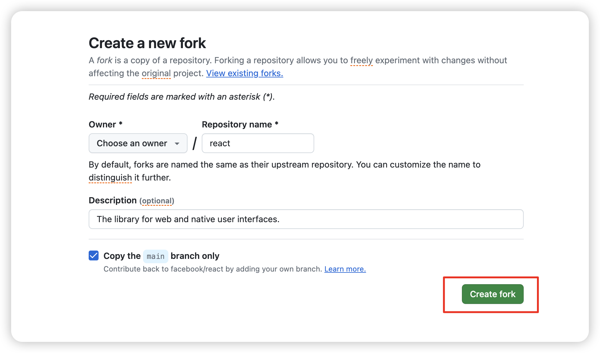
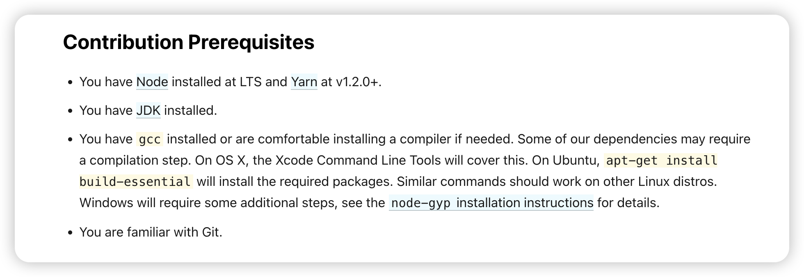
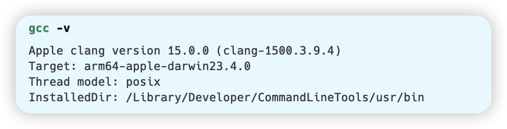
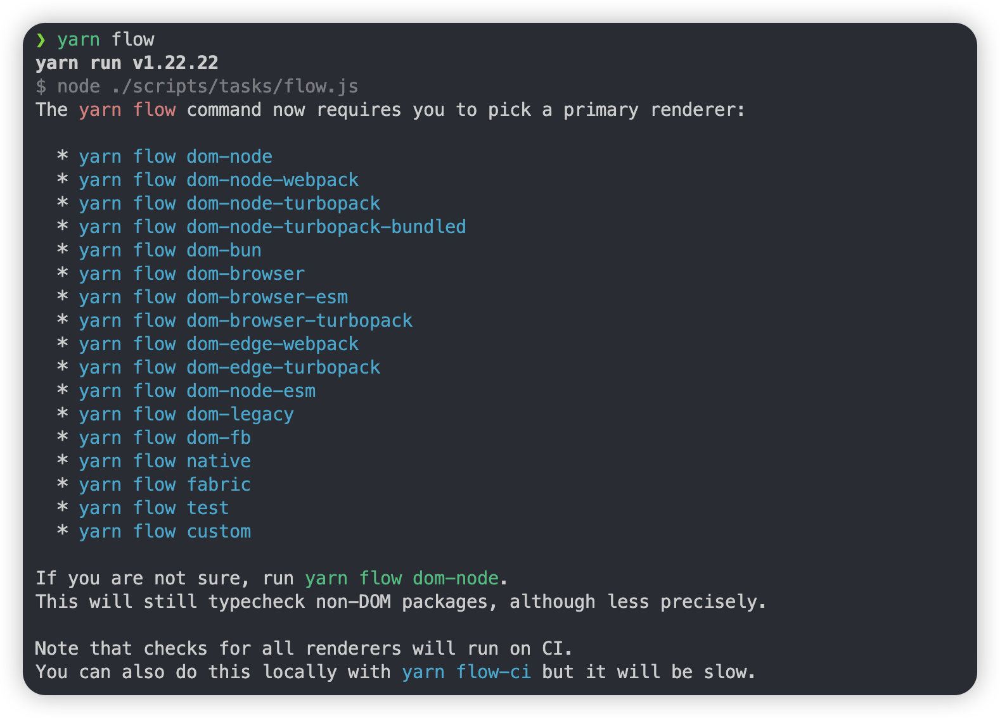
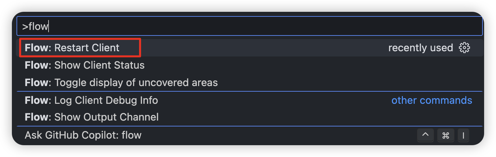
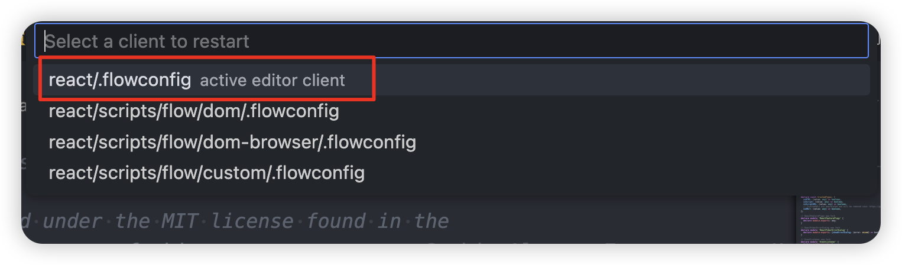
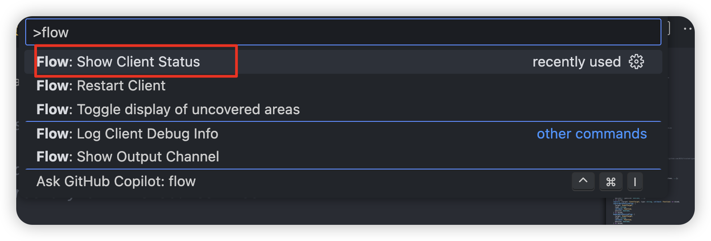
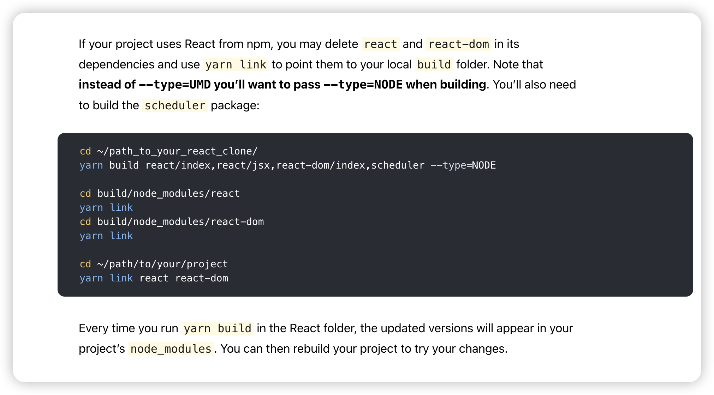

# 如何在本地环境运行 react 源码仓库

## fork 官方仓库 [facebook/react](https://github.com/facebook/react)



通常开源的项目里都有一个 [CONTRIBUTING.md](https://github.com/facebook/react/blob/main/CONTRIBUTING.md) 文件，来让其他的开发者知道如何贡献这个项目，或者看这个项目的 [.github/workflows](https://github.com/facebook/react/tree/main/.github/workflows) 里的一些运行测试、发布的 action 都可以找到运行这个项目的有效信息


本地下载克隆的仓库

```bash
git clone git@github.com:Debbl/react.git
```

## VSCode 环境

使用 VSCode 打开

```bash
code react
```

### 插件

因为 react 是使用 [flow](https://flow.org/) 语言（类似 ts ）写的所以需要在 VSCode 提供相关语言的支持在 VSCode 中下载 flow 语言的插件 [flow-for-vscode](https://marketplace.visualstudio.com/items?itemName=flowtype.flow-for-vscode)

```json filename=".vscode/extensions.json"
{
  "recommendations": ["flowtype.flow-for-vscode"]
}
```

### 设置

在本地的打开的仓库的根目录创建下面这个文件

```json filename=".vscode/settings.json"
{
  "javascript.validate.enable": false,
  "typescript.validate.enable": false,
  "flow.enabled": true,
  "flow.useNPMPackagedFlow": true
}
```

解释一下这里的配置，前两个是禁用默认的 js ts 检查，然后开启 flow 插件，并且使用 `node_modules` 下的 flow 运行，这两个其实是默认开启的，更多详细的配置 [flow-for-vscode#configuration](https://github.com/flow/flow-for-vscode#configuration)

## 本机环境

> 这里可以直接参考 [contribution-prerequisites](https://legacy.reactjs.org/docs/how-to-contribute.html#contribution-prerequisites) 的官方文档，但是有几个需要注意的地方



- `.nvmrc` 里对应的 node 版本，最好安装对应的版本
- `package.json` 的 `packageManager` 有对应的 yarn 版本
- java 环境没有明确说什么版本，我这里安装的是 `java 17.0.11 2024-04-16 LTS`


- gcc 环境



## 安装依赖，环境检查

> 这里可以参考文档的这一部分 [sending-a-pull-request](https://legacy.reactjs.org/docs/how-to-contribute.html#sending-a-pull-request)

完全使用 `yarn.lock` 安装，这里推荐一个好用的工具 [antfu-collective/ni](https://github.com/antfu-collective/ni) 直接使用 `nci` 安装，我也参考别人的项目写了一个 rust 的版本 [Debbl/nci](https://github.com/Debbl/nci)

```bash
yarn install --frozen-lockfile
```

因为我使用的是 M1 芯片，在安装的过程中遇到了几个问题

- `/bin/sh: autoreconf: command not found` 使用 brew 安装 `brew install autoconf`
- 如果上一步是使用 brew 安装的会遇到一个问题 [error-cant-exec-aclocal-with-homebrew-installed-autoreconf-on-mac](https://stackoverflow.com/questions/76852766/error-cant-exec-aclocal-with-homebrew-installed-autoreconf-on-mac) 需要安装 `brew install automake`
- `optipng-bin` 依赖报错，可以看这个 [optipng-bin/issues/117](https://github.com/imagemin/optipng-bin/issues/117#issuecomment-1362473572)

### 配置 flow 环境

```bash
yarn flow
```

这里直接运行这个命令会要求选择对应的环境



这里使用 `dom-node` 环境

```bash
yarn flow dom-node
```

执行完成之后会发现在根目录多了一个 `.flowconfig` 文件


### 检查 flow 有没有生效








完成之后 VSCode 就会有提示了

## 测试，本地运行

```bash
yarn test
```


## 本地运行打包好的 react

> 可以参考文档的 [development-workflow](https://legacy.reactjs.org/docs/how-to-contribute.html#development-workflow)



```bash
cd build/oss-experimental/react
yarn link

cd build/oss-experimental/react-dom
yarn link
```

这里注意 node 环境的话需要 link 三个仓库 `react` `react-dom` `scheduler`

也可以直接使用 `fixtures` 目录的环境，这里我使用 `fixtures/packaging/webpack/dev`

```bash
cd fixtures/packaging/webpack/dev

yarn

yarn build
```

这里需要替换一下 `input.js` 文件，新版 ReactDom 里没有 render 函数了

```js filename="fixtures/packaging/webpack/dev/input.js"
var React = require("react");
var ReactDOM = require("react-dom");

ReactDOM.render(
  React.createElement("h1", null, "Hello World!"),
  document.getElementById("container"),
);
```

```js
var React = require("react");
var { createRoot } = require("react-dom/client");

console.log("react version:", React.version);

const root = createRoot(document.getElementById("container"));
root.render(React.createElement("h1", null, "Hello World!"));
```

使用 [LiveServer](https://marketplace.visualstudio.com/items?itemName=ritwickdey.LiveServer)打开 `fixtures/packaging/webpack/dev/index.html`


